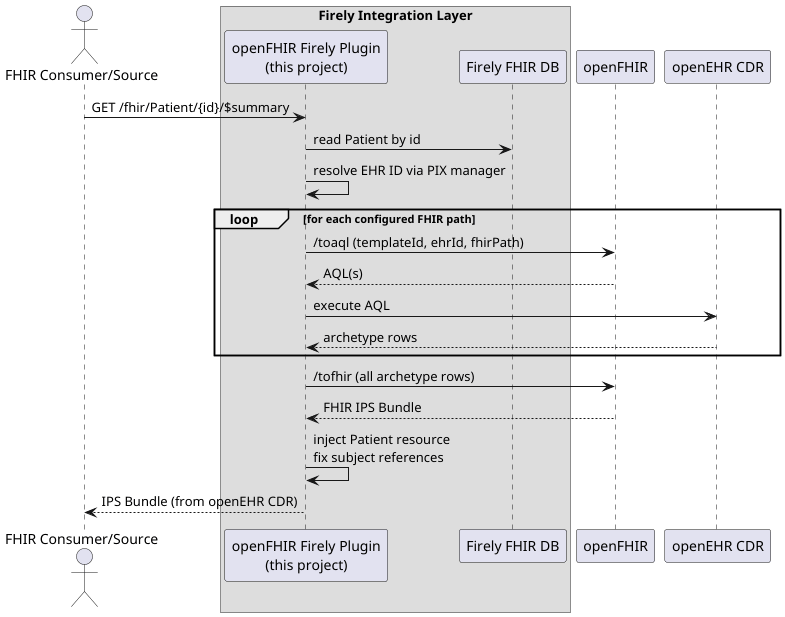

# Infrastructure

```
infrastructure/
  docker-compose.yml        # built up step by step throughout the tutorial
  config/
    appsettings.instance.json
    firely-license.json     # your Firely Server trial license (add this yourself)
    cdrs.yml                # integration for openEHR CDRs
    logsettings.json        # firely logsettings
  vonk-imported/            # create manually before Step 1 (see below)
  .plugins/                 # pre-populated with plugin DLLs
```

## Before you start

Create the `vonk-imported/` directory here (in the workspace dir) with the correct permissions before running
`docker compose up` for the first time.

**Linux / macOS:**

```bash
mkdir -p vonk-imported && chmod 777 vonk-imported
```

**Windows (PowerShell):**

```powershell
New-Item -ItemType Directory -Force -Path vonk-imported
```

## Target Architecture


| Flow                                                     | Diagram                           |
|----------------------------------------------------------|-----------------------------------|
| Querying FHIR resources (e.g. `GET /AllergyIntolerance`) |      |
| Storing FHIR resources (e.g. `POST` IPS Bundle)          |      |
| Fetching the IPS summary document (`$summary`)           |  |
